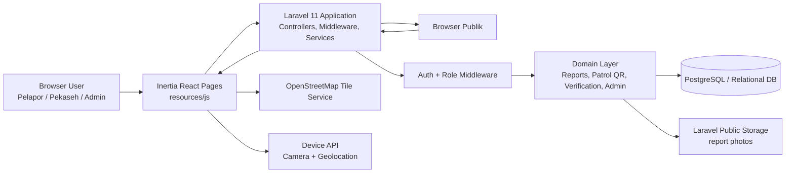

# System Architecture Diagram - E-Matelik

## Ringkasan

E-Matelik saat ini berjalan sebagai aplikasi monolitik `Laravel + Inertia React` dengan database relasional dan penyimpanan file lokal Laravel.

## Mermaid

## Komponen Inti

### 1. Presentation Layer

* Inertia React pages
* Tailwind CSS
* Leaflet untuk peta
* Html5Qrcode untuk scan QR

### 2. Application Layer

* Laravel controllers
* form requests
* middleware role
* uploader service

### 3. Domain Layer

* laporan gangguan
* verifikasi Pekaseh
* closed-loop evidence
* checkpoint patrol QR
* patrol logs

### 4. Data Layer

* tabel inti laporan
* tabel patrol point dan patrol log
* public storage untuk file gambar

## Catatan

* Sistem belum memakai object storage produksi.
* Sistem belum memisahkan backend dan frontend menjadi service terpisah.
* Integrasi kamera dan geolocation berlangsung di sisi browser.
